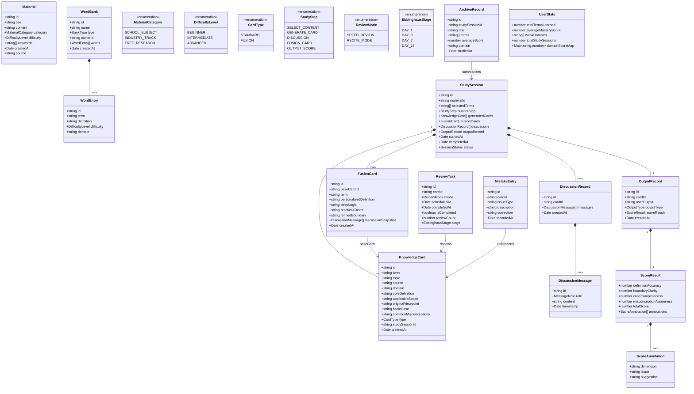
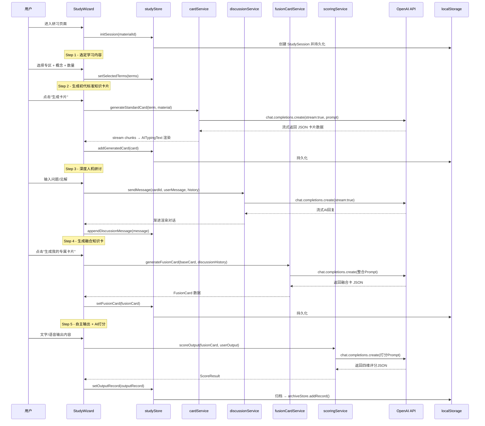
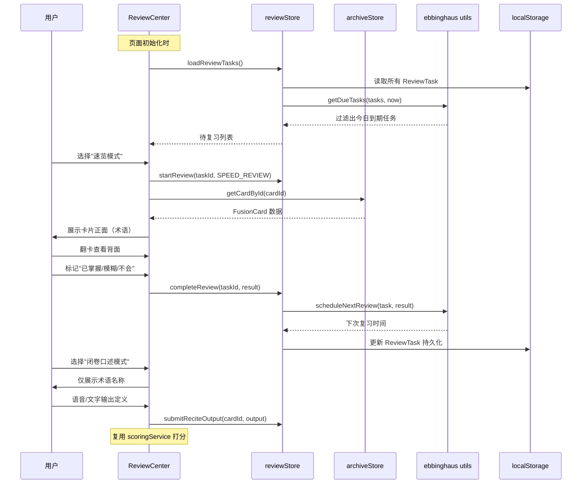

# 《知卡研习》系统架构设计文档

> 架构师：高见远（Gao）  
> 版本：V1.0  
> 技术栈：Vite + React 18 + MUI v5 + Tailwind CSS + React Router v6 + OpenAI API

---

## Part A：系统设计

---

### 1. 实现方案概述

#### 1.1 核心技术挑战

| 挑战 | 解决方案 |
|------|----------|
| 多步骤研习主流程的状态管理 | Zustand 轻量状态机，按模块分 store |
| AI 对话 + 卡片生成的流式交互 | OpenAI SDK（stream: true），SSE 渐进渲染 |
| 本地数据持久化（无后端） | localStorage + Zustand persist 中间件 |
| 复习系统的定时推送逻辑 | 纯前端计算艾宾浩斯时间点，页面初始化时触发提醒 |
| 语音输出录制 | Web Speech API (SpeechRecognition) |
| 复杂数据的检索与统计 | 内存计算 + useMemo 缓存，不引入额外DB |

#### 1.2 框架选型理由

- **Vite**：极速HMR，优化构建体积，适合纯前端项目
- **React 18**：并发模式支持流式AI渲染，生态丰富
- **MUI v5**：成熟的企业级组件库，Drawer/Stepper/Timeline 可直接复用于研习流程和档案馆
- **Tailwind CSS**：与MUI互补，用于布局、间距、自定义样式
- **Zustand**：比 Redux 简洁，比 Context 性能好，配合 persist 中间件天然支持 localStorage
- **React Router v6**：声明式路由，支持 Outlet 嵌套布局

#### 1.3 架构模式

采用 **Feature-Sliced Design（FSD）变体**，按功能模块组织代码：

```
src/
├── pages/          # 路由页面（薄层，组合 features 组件）
├── features/       # 功能模块（独立业务逻辑 + UI）
├── components/     # 通用 UI 组件
├── store/          # Zustand 全局状态
├── services/       # OpenAI API 调用封装
├── hooks/          # 自定义 Hooks
├── types/          # TypeScript 类型定义
├── utils/          # 工具函数
└── constants/      # 常量配置
```

---

### 2. 完整文件列表

```
知识卡片研习/
├── index.html
├── vite.config.ts
├── tsconfig.json
├── tsconfig.node.json
├── tailwind.config.ts
├── postcss.config.js
├── package.json
├── .env.example
│
└── src/
    ├── main.tsx                          # 应用入口
    ├── App.tsx                           # 路由根组件
    │
    ├── types/
    │   ├── index.ts                      # 统一导出
    │   ├── card.types.ts                 # 知识卡片相关类型
    │   ├── material.types.ts             # 素材库相关类型
    │   ├── study.types.ts                # 研习流程相关类型
    │   ├── review.types.ts               # 复习系统相关类型
    │   └── archive.types.ts              # 学习档案相关类型
    │
    ├── constants/
    │   ├── routes.ts                     # 路由路径常量
    │   ├── ai-prompts.ts                 # AI Prompt 模板
    │   ├── ebbinghaus.ts                 # 艾宾浩斯复习间隔配置
    │   └── card-template.ts             # 知识卡片固定模板字段
    │
    ├── store/
    │   ├── index.ts                      # store 统一导出
    │   ├── materialStore.ts              # 素材库状态
    │   ├── studyStore.ts                 # 研习主流程状态（核心）
    │   ├── archiveStore.ts               # 学习档案状态
    │   ├── reviewStore.ts                # 复习系统状态
    │   └── uiStore.ts                    # UI 全局状态（侧边栏、主题等）
    │
    ├── services/
    │   ├── openai.ts                     # OpenAI 客户端初始化
    │   ├── cardService.ts                # 生成标准卡片 API
    │   ├── discussionService.ts          # 深度研讨对话 API
    │   ├── fusionCardService.ts          # 生成融合卡片 API
    │   └── scoringService.ts             # 四维打分 API
    │
    ├── hooks/
    │   ├── useStudySession.ts            # 研习会话管理 Hook
    │   ├── useReviewSchedule.ts          # 复习计划计算 Hook
    │   ├── useSpeechRecognition.ts       # 语音识别 Hook
    │   ├── useLocalStorage.ts            # localStorage 工具 Hook
    │   └── useAIStream.ts                # AI 流式响应 Hook
    │
    ├── utils/
    │   ├── ebbinghaus.ts                 # 艾宾浩斯时间计算
    │   ├── scoring.ts                    # 打分结果解析
    │   ├── exportUtils.ts                # 一键导出工具（讲稿/文案）
    │   └── dateUtils.ts                  # 日期格式化工具
    │
    ├── components/
    │   ├── layout/
    │   │   ├── AppLayout.tsx             # 全局布局（侧边栏+主区域）
    │   │   ├── Sidebar.tsx               # 左侧导航
    │   │   └── TopBar.tsx                # 顶部栏
    │   ├── ui/
    │   │   ├── KnowledgeCard.tsx         # 知识卡片展示组件
    │   │   ├── CardFlip.tsx              # 卡片翻转动效组件
    │   │   ├── ScoreRadar.tsx            # 四维雷达图（recharts）
    │   │   ├── AITypingText.tsx          # AI流式文字渲染组件
    │   │   ├── VoiceInput.tsx            # 语音输入按钮组件
    │   │   ├── ConfirmDialog.tsx         # 通用确认弹窗
    │   │   └── EmptyState.tsx            # 空状态占位组件
    │   └── icons/
    │       └── CustomIcons.tsx           # 自定义 SVG 图标
    │
    ├── features/
    │   ├── materials/
    │   │   ├── MaterialCenter.tsx        # 素材中心主页
    │   │   ├── MaterialLibrary.tsx       # 分类库列表
    │   │   ├── WordBankEditor.tsx        # 词库编辑器
    │   │   ├── UploadMaterial.tsx        # 上传素材组件
    │   │   └── DifficultyBadge.tsx       # 难度等级徽章
    │   │
    │   ├── study/
    │   │   ├── StudyWizard.tsx           # 研习五步流程主控组件（Stepper）
    │   │   ├── Step1_SelectContent.tsx   # 步骤1：选定学习内容
    │   │   ├── Step2_GenerateCard.tsx    # 步骤2：生成初代知识卡片
    │   │   ├── Step3_Discussion.tsx      # 步骤3：深度人机研讨
    │   │   ├── Step4_FusionCard.tsx      # 步骤4：生成融合知识卡
    │   │   └── Step5_OutputScore.tsx     # 步骤5：自主输出+AI打分
    │   │
    │   ├── archive/
    │   │   ├── ArchiveCenter.tsx         # 档案馆主页
    │   │   ├── TimelineView.tsx          # 时间线视图
    │   │   ├── ArchiveDetail.tsx         # 单条档案详情
    │   │   └── StatsPanel.tsx            # 统计数据面板
    │   │
    │   ├── review/
    │   │   ├── ReviewCenter.tsx          # 复习中心主页
    │   │   ├── ReviewQueue.tsx           # 待复习队列
    │   │   ├── SpeedReview.tsx           # 速览模式
    │   │   ├── ReciteMode.tsx            # 闭卷口述模式
    │   │   ├── MistakeBook.tsx           # 思维错题本
    │   │   └── FinalAssessment.tsx       # 阶段综合测评
    │   │
    │   └── output/
    │       ├── OutputCenter.tsx          # 实战输出中心
    │       ├── SceneSelector.tsx         # 场景选择（学生/职场）
    │       ├── OutputTemplates.tsx       # 输出模板列表
    │       └── ExportPanel.tsx           # 一键导出面板
    │
    └── pages/
        ├── HomePage.tsx                  # 首页/仪表盘
        ├── MaterialPage.tsx              # 素材资源页
        ├── StudyPage.tsx                 # 研习主流程页
        ├── ArchivePage.tsx               # 档案馆页
        ├── ReviewPage.tsx                # 复习中心页
        ├── OutputPage.tsx                # 实战输出页
        └── SettingsPage.tsx              # 设置页（API Key等）
```

---

### 3. 数据结构定义



---

### 4. 程序调用流程（核心时序图）

#### 4.1 研习五步流程主时序



#### 4.2 复习系统时序



---

### 5. 待明确事项

1. **API Key 管理**：V1.0 采用用户在设置页手动输入 OpenAI API Key，存于 localStorage，未加密。建议 V1.1 加入简单加密（如 XOR/base64 混淆）。
2. **语音输入兼容性**：Web Speech API 在 Chrome 上支持良好，Firefox/Safari 有限制，需在 UI 上标注浏览器兼容提示。
3. **流式 JSON 解析**：AI 生成卡片 JSON 时，需用 partial-json 或手动缓冲解析，避免流式截断导致 JSON.parse 失败。
4. **词库内置数据**：PRD 提及平台内置公共免费词库，V1.0 建议以静态 JSON 文件内置在 `/public/wordbanks/` 目录下，模拟后端。
5. **文件上传**：用户上传本地文档（PDF/TXT）的解析，V1.0 可使用 `file-reader` API 读取纯文本，PDF 可集成 `pdfjs-dist`。

---

## Part B：任务分解

---

### 6. 依赖包列表

```json
{
  "dependencies": {
    "react": "^18.2.0",
    "react-dom": "^18.2.0",
    "react-router-dom": "^6.22.0",
    "@mui/material": "^5.15.0",
    "@mui/icons-material": "^5.15.0",
    "@mui/lab": "^5.0.0-alpha.165",
    "@emotion/react": "^11.11.0",
    "@emotion/styled": "^11.11.0",
    "openai": "^4.28.0",
    "zustand": "^4.5.0",
    "recharts": "^2.10.0",
    "pdfjs-dist": "^4.0.379",
    "uuid": "^9.0.0",
    "dayjs": "^1.11.10",
    "partial-json": "^0.1.7"
  },
  "devDependencies": {
    "vite": "^5.1.0",
    "@vitejs/plugin-react": "^4.2.0",
    "typescript": "^5.3.0",
    "@types/react": "^18.2.0",
    "@types/react-dom": "^18.2.0",
    "@types/uuid": "^9.0.0",
    "tailwindcss": "^3.4.0",
    "autoprefixer": "^10.4.0",
    "postcss": "^8.4.0"
  }
}
```

---

### 7. 任务列表（按依赖顺序）

#### T01 · 项目基础设施

| 字段 | 内容 |
|------|------|
| **任务ID** | T01 |
| **任务名** | 项目基础设施搭建 |
| **优先级** | P0 |
| **依赖** | 无 |

**涉及文件**：
- `package.json`
- `vite.config.ts`
- `tsconfig.json` / `tsconfig.node.json`
- `tailwind.config.ts`
- `postcss.config.js`
- `.env.example`
- `index.html`
- `src/main.tsx`
- `src/App.tsx`（路由注册骨架）
- `src/constants/routes.ts`
- `src/constants/ebbinghaus.ts`
- `src/constants/card-template.ts`
- `src/constants/ai-prompts.ts`
- `src/components/layout/AppLayout.tsx`
- `src/components/layout/Sidebar.tsx`
- `src/components/layout/TopBar.tsx`
- `src/pages/HomePage.tsx`（占位）
- `src/pages/SettingsPage.tsx`（API Key 设置）

**实现要点**：
- Vite + React + TypeScript 初始化，配置路径别名 `@/` → `src/`
- Tailwind CSS 与 MUI 共存配置（MUI 使用 emotion，Tailwind 用 `important: true` 避免样式冲突）
- 配置 MUI Theme（主色、字体、暗色模式预留）
- AppLayout 实现左侧 Sidebar（240px）+ 右侧主区域布局
- Sidebar 包含五大模块导航链接，使用 MUI `Drawer`
- SettingsPage 提供 OpenAI API Key 输入框，存入 localStorage
- `ai-prompts.ts` 定义所有 AI Prompt 模板常量（卡片生成/研讨/融合/打分）

---

#### T02 · 数据层（类型 + 状态管理）

| 字段 | 内容 |
|------|------|
| **任务ID** | T02 |
| **任务名** | 数据层（TypeScript 类型 + Zustand Store） |
| **优先级** | P0 |
| **依赖** | T01 |

**涉及文件**：
- `src/types/card.types.ts`
- `src/types/material.types.ts`
- `src/types/study.types.ts`
- `src/types/review.types.ts`
- `src/types/archive.types.ts`
- `src/types/index.ts`
- `src/store/materialStore.ts`
- `src/store/studyStore.ts`
- `src/store/archiveStore.ts`
- `src/store/reviewStore.ts`
- `src/store/uiStore.ts`
- `src/store/index.ts`
- `src/utils/ebbinghaus.ts`
- `src/utils/dateUtils.ts`
- `src/utils/scoring.ts`
- `src/utils/exportUtils.ts`

**实现要点**：
- 严格按类图定义所有 TypeScript interface/type/enum
- Zustand store 均使用 `persist` 中间件，key 命名规范：`zhika-{module}-store`
- `studyStore`：维护当前 `StudySession` 状态机，提供 `initSession/nextStep/prevStep/addCard/setFusionCard/setOutputRecord` 等 action
- `reviewStore`：维护 `ReviewTask[]`，提供 `loadDueTasks/completeReview/scheduleNext` 等
- `archiveStore`：归档完成的 session，提供统计计算（`computeUserStats()`）
- `ebbinghaus.ts`：实现 `getDueTasks(tasks, now)` 和 `getNextReviewDate(stage)` 函数

---

#### T03 · AI 服务层 + 通用 UI 组件

| 字段 | 内容 |
|------|------|
| **任务ID** | T03 |
| **任务名** | AI 服务层 + 核心通用组件 |
| **优先级** | P0 |
| **依赖** | T02 |

**涉及文件**：
- `src/services/openai.ts`
- `src/services/cardService.ts`
- `src/services/discussionService.ts`
- `src/services/fusionCardService.ts`
- `src/services/scoringService.ts`
- `src/hooks/useAIStream.ts`
- `src/hooks/useStudySession.ts`
- `src/hooks/useSpeechRecognition.ts`
- `src/hooks/useReviewSchedule.ts`
- `src/hooks/useLocalStorage.ts`
- `src/components/ui/KnowledgeCard.tsx`
- `src/components/ui/CardFlip.tsx`
- `src/components/ui/ScoreRadar.tsx`
- `src/components/ui/AITypingText.tsx`
- `src/components/ui/VoiceInput.tsx`
- `src/components/ui/ConfirmDialog.tsx`
- `src/components/ui/EmptyState.tsx`

**实现要点**：
- `openai.ts`：从 localStorage 读取 API Key，实例化 `OpenAI` client（注意浏览器端需 `dangerouslyAllowBrowser: true`）
- 各 service 使用 `useAIStream` hook 处理流式响应，回调 `onChunk(text)` 供 UI 渐进渲染
- `cardService`：Prompt 注入 card-template 字段，要求 AI 返回合法 JSON，使用 `partial-json` 处理流式截断
- `scoringService`：Prompt 要求返回 `{definitionAccuracy, boundaryClarity, caseCompleteness, misconceptionAwareness, annotations[]}` JSON
- `KnowledgeCard.tsx`：展示标准卡片全部字段，支持 `compact` / `full` 两种展示模式
- `CardFlip.tsx`：CSS 3D 翻转动效，正面展示术语，背面展示定义
- `ScoreRadar.tsx`：使用 recharts `RadarChart` 展示四维打分
- `AITypingText.tsx`：接收流式文字 chunk，逐字打印动效
- `VoiceInput.tsx`：封装 Web Speech API，按住说话/点击开始两种模式

---

#### T04 · 研习主流程 + 素材中心

| 字段 | 内容 |
|------|------|
| **任务ID** | T04 |
| **任务名** | 研习五步流程 + 素材资源中心 |
| **优先级** | P1 |
| **依赖** | T03 |

**涉及文件**：
- `src/features/study/StudyWizard.tsx`
- `src/features/study/Step1_SelectContent.tsx`
- `src/features/study/Step2_GenerateCard.tsx`
- `src/features/study/Step3_Discussion.tsx`
- `src/features/study/Step4_FusionCard.tsx`
- `src/features/study/Step5_OutputScore.tsx`
- `src/features/materials/MaterialCenter.tsx`
- `src/features/materials/MaterialLibrary.tsx`
- `src/features/materials/WordBankEditor.tsx`
- `src/features/materials/UploadMaterial.tsx`
- `src/features/materials/DifficultyBadge.tsx`
- `src/pages/StudyPage.tsx`
- `src/pages/MaterialPage.tsx`

**实现要点**：
- `StudyWizard`：使用 MUI `Stepper`（水平步骤条），每步对应一个子组件，通过 `studyStore.currentStep` 驱动
- **Step1**：三列选择面板（专区 → 词库/概念列表 → 已选列表），数量滑块（5-30），确认后 `initSession`
- **Step2**：遍历 selectedTerms，逐一调用 `cardService`，展示生成进度条 + `AITypingText` 渲染，完成后展示卡片列表
- **Step3**：左侧卡片预览，右侧对话框（MUI `List` 渲染消息历史），底部输入框，支持 `VoiceInput`
- **Step4**：点击触发 `fusionCardService`，流式渲染融合卡片字段，对比展示原版 vs 融合版差异
- **Step5**：文本域/语音输入用户输出，点击提交调用 `scoringService`，展示 `ScoreRadar` + 逐条 `ScoreAnnotation`
- `MaterialCenter`：Tab 切换三种分类，支持搜索、难度筛选；`UploadMaterial` 支持拖拽上传 TXT/PDF

---

#### T05 · 档案馆 + 复习系统 + 实战输出

| 字段 | 内容 |
|------|------|
| **任务ID** | T05 |
| **任务名** | 历史档案 + 智能复习 + 实战输出 |
| **优先级** | P1 |
| **依赖** | T04 |

**涉及文件**：
- `src/features/archive/ArchiveCenter.tsx`
- `src/features/archive/TimelineView.tsx`
- `src/features/archive/ArchiveDetail.tsx`
- `src/features/archive/StatsPanel.tsx`
- `src/features/review/ReviewCenter.tsx`
- `src/features/review/ReviewQueue.tsx`
- `src/features/review/SpeedReview.tsx`
- `src/features/review/ReciteMode.tsx`
- `src/features/review/MistakeBook.tsx`
- `src/features/review/FinalAssessment.tsx`
- `src/features/output/OutputCenter.tsx`
- `src/features/output/SceneSelector.tsx`
- `src/features/output/OutputTemplates.tsx`
- `src/features/output/ExportPanel.tsx`
- `src/pages/ArchivePage.tsx`
- `src/pages/ReviewPage.tsx`
- `src/pages/OutputPage.tsx`

**实现要点**：
- **档案馆**：`TimelineView` 使用 MUI Lab `Timeline` 组件，按日期分组展示历史学习记录；`StatsPanel` 展示词汇量/平均分/薄弱领域条形图（recharts）
- **复习系统**：页面加载时调用 `useReviewSchedule` 计算当日到期任务，`ReviewQueue` 展示待复习卡片数；`SpeedReview` 使用 `CardFlip` 组件；`ReciteMode` 仅展示术语 + 语音/文字输入 + 调用 `scoringService` 打分；`MistakeBook` 记录历次输出中 score < 60 分的 annotation
- **实战输出**：`SceneSelector` 区分学生端/职场端；`OutputTemplates` 按场景展示可填充模板；`ExportPanel` 提供一键复制/下载 TXT 功能（`exportUtils.ts`）
- `FinalAssessment`：随机抽取该阶段学习的概念，综合测评，复用打分服务

---

### 8. 共享知识（跨文件约定）

#### 8.1 命名规范

| 类型 | 规范 | 示例 |
|------|------|------|
| 组件文件 | PascalCase | `KnowledgeCard.tsx` |
| Hook 文件 | camelCase + use前缀 | `useAIStream.ts` |
| Store 文件 | camelCase + Store后缀 | `studyStore.ts` |
| 类型文件 | camelCase + .types.ts | `card.types.ts` |
| 常量变量 | UPPER_SNAKE_CASE | `EBBINGHAUS_INTERVALS` |

#### 8.2 localStorage Key 规范

```
zhika-material-store     → 素材库数据
zhika-study-store        → 当前研习会话
zhika-archive-store      → 历史档案
zhika-review-store       → 复习任务队列
zhika-ui-store           → UI 状态
zhika-settings           → API Key 等设置
```

#### 8.3 AI Prompt 约定

- 所有 Prompt 统一定义在 `src/constants/ai-prompts.ts`，导出为模板函数
- 要求 AI 返回 JSON 时，Prompt 末尾统一加：`请严格返回合法 JSON 格式，不要包含任何 markdown 代码块标记。`
- 流式 JSON 解析使用 `partial-json` 库的 `parse()` 函数，容忍不完整 JSON

#### 8.4 状态管理约定

```typescript
// Zustand store 标准结构
interface XxxState {
  // 数据字段
  data: XxxType[]
  loading: boolean
  error: string | null
  
  // Actions
  loadData: () => void
  addItem: (item: XxxType) => void
  updateItem: (id: string, patch: Partial<XxxType>) => void
  removeItem: (id: string) => void
  reset: () => void
}
```

#### 8.5 错误处理约定

- OpenAI API 调用统一用 try/catch，错误存入 store 的 `error` 字段
- UI 层通过 MUI `Snackbar` + `Alert` 展示错误信息
- 网络超时默认 30s，在 `openai.ts` 配置 `timeout: 30000`

#### 8.6 日期处理

- 所有日期统一使用 `dayjs`，存储为 ISO 8601 字符串（`dayjs().toISOString()`）
- 艾宾浩斯间隔配置（`src/constants/ebbinghaus.ts`）：

```typescript
export const EBBINGHAUS_INTERVALS = [1, 3, 7, 15] // 单位：天
```

#### 8.7 路由结构

```
/                   → HomePage（仪表盘）
/materials          → MaterialPage（素材中心）
/study              → StudyPage（研习主流程）
/archive            → ArchivePage（档案馆）
/review             → ReviewPage（复习中心）
/output             → OutputPage（实战输出）
/settings           → SettingsPage（系统设置）
```

---

### 9. 任务依赖图


---

## Part C：部署方案（海外版 i18n）

> 适用版本：V2.0 国际化版  
> 更新日期：2026-05-17

---

### 1. 推荐部署方案

#### 1.1 前端部署（免费）

| 平台 | 免费额度 | Git 部署 | CDN | 推荐度 |
|------|----------|----------|-----|--------|
| **Vercel** | 100GB 流量/月 | ✅ | ✅ 内置 | ⭐⭐⭐⭐⭐ |
| **Cloudflare Pages** | 10万次请求/天 | ✅ | ✅ 全球CDN | ⭐⭐⭐⭐⭐ |
| **Netlify** | 100GB 流量/月 | ✅ | ✅ | ⭐⭐⭐⭐ |

**推荐首选：Vercel**
- 与 GitHub 无缝集成，push 代码自动部署
- 内置 CDN，全球访问速度快
- 支持 Serverless Functions（后续会员系统可用）

**备选：Cloudflare Pages**
- 免费额度更大
- Workers Functions 可做后端逻辑
- D1 数据库支持 SQLite

#### 1.2 后端/数据层（如需会员系统）

| 平台 | 免费额度 | 数据库 | 认证 | 推荐度 |
|------|----------|--------|------|--------|
| **Supabase** | 500MB 数据库 + 1GB 文件 | PostgreSQL | GitHub/Google/邮箱 | ⭐⭐⭐⭐⭐ |
| **Firebase** | 1GB 数据库 + 5GB 文件 | Firestore | Google/Apple/匿名 | ⭐⭐⭐⭐ |

**推荐首选：Supabase**
- PostgreSQL 关系型数据库，SQL 查询强大
- 内置用户认证（GitHub OAuth 一键接入）
- Edge Functions 可写 Serverless API

---

### 2. 推荐架构

```
用户浏览器
    │
    ▼
┌─────────────────────────────────────────┐
│  Vercel / Cloudflare Pages (免费)        │
│  ├── 前端静态资源（index.html, js, css） │
│  └── Serverless Functions（可选）        │
└─────────────────────────────────────────┘
    │
    ▼
┌─────────────────────────────────────────┐
│  Supabase (免费)                         │
│  ├── auth.users（GitHub 登录）           │
│  ├── tokens（用户 Token 余额）           │
│  └── usage_logs（API 调用记录）           │
└─────────────────────────────────────────┘
    │
    ▼
DeepSeek / OpenAI API（费用由用户余额扣除）
```

---

### 3. i18n 国际化实施

#### 3.1 推荐方案

| 方案 | 优点 | 缺点 | 推荐度 |
|------|------|------|--------|
| **react-i18next** | 生态成熟、热更新、TypeScript 支持好 | 需手动翻译 | ⭐⭐⭐⭐⭐ |
| **react-intl** | FormatJS 强大 | 学习曲线 | ⭐⭐⭐ |
| **lingui** | 编译时优化、性能好 | 文档较少 | ⭐⭐⭐ |

**推荐首选：react-i18next**

#### 3.2 实施步骤

```bash
# 1. 安装依赖
npm install i18next react-i18next i18next-browser-languagedetector i18next-http-backend

# 2. 目录结构
src/
├── i18n/
│   ├── index.ts              # i18n 配置
│   ├── locales/
│   │   ├── zh.json           # 中文
│   │   └── en.json           # 英文
│   └── zh.ts                 # 中文翻译（开发中作为基准语言）
```

#### 3.3 翻译内容清单

| 模块 | 翻译量 | 说明 |
|------|--------|------|
| 导航/菜单 | ~50条 | Sidebar、TopBar |
| 研习流程 | ~200条 | 五步流程、按钮、提示 |
| 素材中心 | ~80条 | 分类、难度、导入导出 |
| AI 对话 | ~100条 | 思考中、完成、错误提示 |
| 设置页 | ~60条 | API配置、导入导出 |
| 通用 | ~100条 | 日期、分数、确认对话框 |

**预计总翻译量：~600条**（中文 → 英文）

#### 3.4 翻译优先级

| 优先级 | 内容 | 理由 |
|--------|------|------|
| P0 | 导航、按钮、表单标签 | 必读才能操作 |
| P1 | 研习流程、AI 对话 | 核心功能 |
| P2 | 帮助提示、错误信息 | 提升体验 |

---

### 4. 二期会员系统功能点

| 功能 | 说明 | 优先级 |
|------|------|--------|
| GitHub OAuth 登录 | Supabase Auth，一键接入 | P0 |
| Token 余额管理 | 用户充值 → 余额扣费 | P0 |
| API 调用计费 | Serverless Function 计数 | P0 |
| 游客模式 | 不登录也能用（用自己的 API Key） | P1 |
| 订阅制（可选） | 月卡/年卡 | P2 |

---

### 5. 一键部署脚本

#### 5.1 Vercel 部署

```bash
# 方式1：GitHub 一键导入
# 访问 https://vercel.com/new
# 导入 github.com/shssun/knowledgeCardLearning

# 方式2：CLI 部署
npm i -g vercel
vercel login
vercel --prod
```

#### 5.2 Cloudflare Pages 部署

```bash
# 安装 Wrangler CLI
npm i -g wrangler

# 登录并部署
wrangler pages deploy dist --project-name=zhika-learning
```

---

### 6. 环境变量配置

部署时需配置：

```bash
# Vercel / Cloudflare Pages
VITE_API_BASE_URL=https://api.deepseek.com
VITE_SUPABASE_URL=https://xxx.supabase.co
VITE_SUPABASE_ANON_KEY=xxx
```

---

### 7. 域名绑定（可选）

| 平台 | 免费域名 | 自定义域名 |
|------|----------|------------|
| Vercel | `.vercel.app` | ✅ 免费 |
| Cloudflare Pages | `.pages.dev` | ✅ 免费 |
| Netlify | `.netlify.app` | ✅ 免费 |

**推荐**：先上线用免费域名，验证后再绑定自定义域名。

---

*文档更新时间：2026-05-17 | 更新内容：添加海外部署方案 + i18n 国际化规划*
