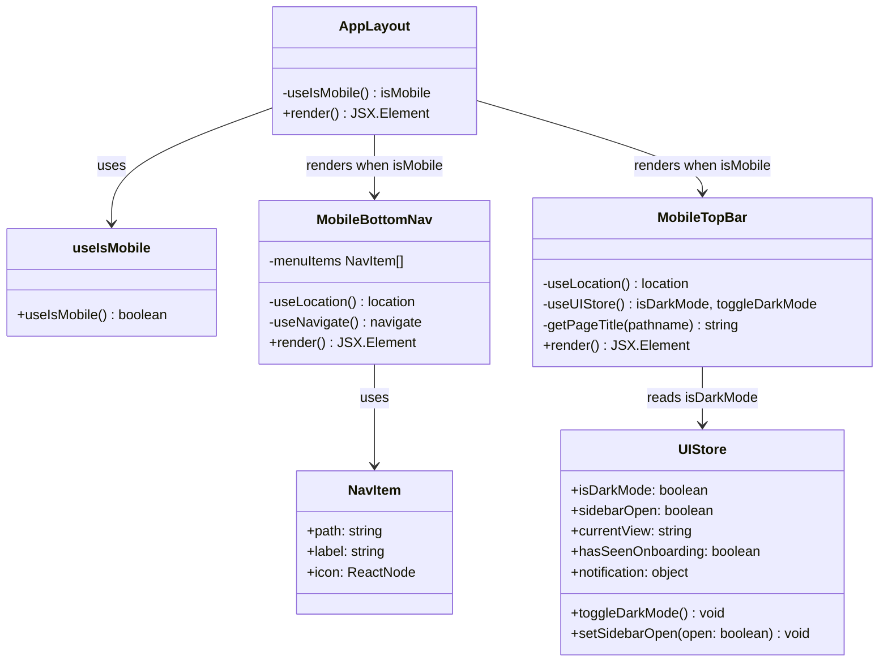
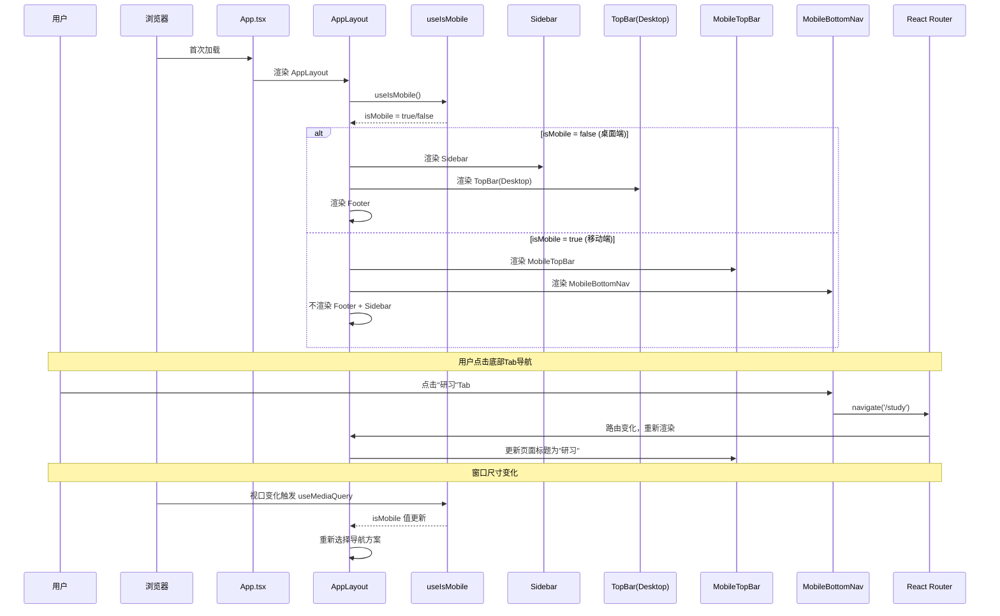
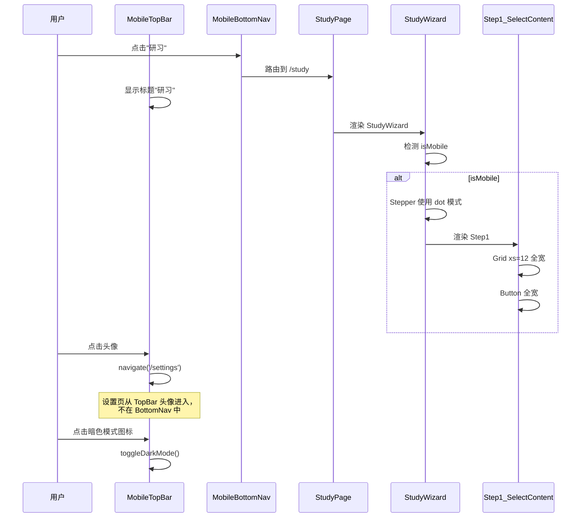
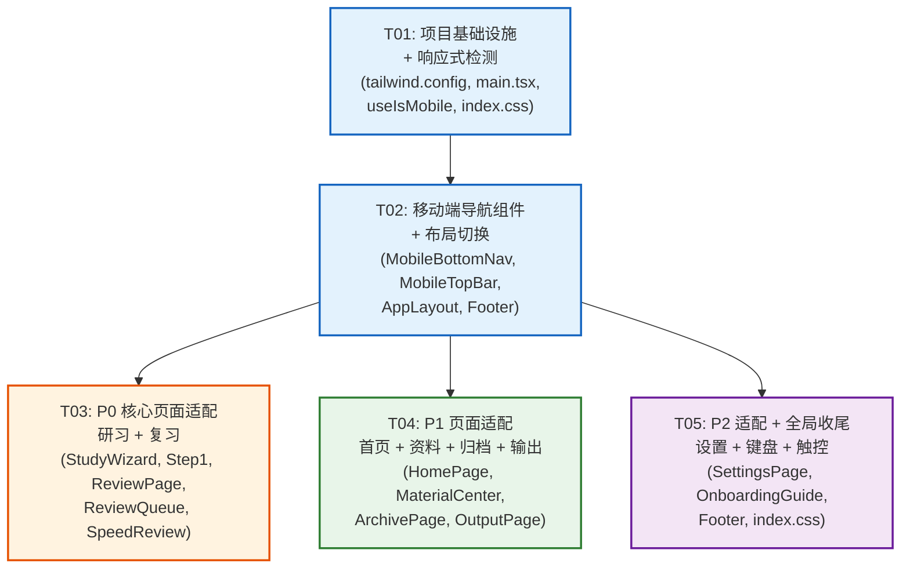

# 知卡研习 — 移动端全站适配架构设计

---

## Part A: 系统设计

### 1. 实现方案 + 框架选型

#### 1.1 核心技术挑战

| 挑战 | 说明 |
|------|------|
| **导航体系切换** | 桌面端 Sidebar(permanent Drawer) 需在 `< md` 时切换为底部Tab + 精简TopBar，涉及 AppLayout / Sidebar / TopBar 三个组件联动 |
| **断点对齐** | MUI 默认断点(sm:600, md:900) 与 Tailwind 默认断点(sm:640, md:768) 不对齐，需统一 |
| **Stepper 移动端适配** | 研习页 5 步 Stepper 在窄屏溢出，需切换为 compact/dot 模式 |
| **Tabs 横向溢出** | 复习页(5个Tab)、归档页(3个Tab) 在移动端需 `variant="scrollable"` |
| **卡片行布局坍塌** | ReviewQueue 任务卡片使用 `flex-direction: row`，移动端需切换为 column |
| **键盘弹出处理** | 虚拟键盘弹出时底部固定栏需隐藏或上推，使用 `visualViewport` API |
| **最小触控区域** | 全局所有可点击元素需满足 44×44px 最小尺寸 |

#### 1.2 框架与方案选型

| 决策 | 选择 | 理由 |
|------|------|------|
| **底部导航** | MUI `<BottomNavigation>` | 原生 MUI 组件，与现有 MUI 技术栈一致，自带 active 指示器、label 显示/隐藏、icon 动效 |
| **响应式检测** | MUI `useMediaQuery` + `useTheme` | 与 MUI 断点体系一致，SSR 安全，精确控制；不使用 zustand 存 isMobile（避免同步问题） |
| **移动端 TopBar** | 自定义精简 AppBar（非 MUI BottomNavigation 一部分） | PRD 要求顶部有"标题 + 暗色模式 + 头像"，与底部 Tab 职责分离 |
| **Tailwind 断点对齐** | 修改 `tailwind.config.ts` 的 `screens` 字段对齐 MUI | `important: true` 已启用，修改 screens 即可统一 |
| **主题扩展** | 在 `main.tsx` 的 `createTheme` 中增加响应式 typography | 统一移动端字体缩放，无需额外包 |
| **键盘适配** | CSS `env(safe-area-inset-bottom)` + JS `visualViewport.resize` 事件 | 轻量、兼容性好，无需额外包 |

#### 1.3 架构模式

保持现有 **MVC-like** 模式不变（路由 → 页面 → 功能组件 → Store），仅在布局层引入响应式分支：

```
AppLayout
├── md↑: Sidebar + TopBar(desktop) + MainContent + Footer
└── <md: MobileTopBar + MainContent + MobileBottomNav (无 Footer)
```

---

### 2. 文件列表

#### 2.1 新增文件

| 文件路径 | 说明 |
|----------|------|
| `src/hooks/useIsMobile.ts` | 移动端检测 Hook，封装 `useMediaQuery(theme.breakpoints.down('md'))` |
| `src/components/layout/MobileBottomNav.tsx` | 底部 Tab 导航组件（5项：首页/资料中心/研习/复习/归档） |
| `src/components/layout/MobileTopBar.tsx` | 移动端精简顶部栏（标题 + 暗色模式 + 头像入口） |

#### 2.2 修改文件

| 文件路径 | 修改点 |
|----------|--------|
| `tailwind.config.ts` | 添加 `screens` 配置，对齐 MUI 断点 |
| `src/main.tsx` | 扩展 `createTheme`：添加响应式 typography、组件默认 props（BottomNavigation 等） |
| `src/index.css` | 添加移动端全局 CSS：最小触控区域、safe-area、键盘适配、底部导航占位 |
| `src/store/uiStore.ts` | 无变更（`sidebarOpen` 已预留，移动端直接用 `useIsMobile` 控制显隐） |
| `src/components/layout/AppLayout.tsx` | 条件渲染：`md↑` 用 Sidebar+TopBar+Footer，`<md` 用 MobileTopBar+MobileBottomNav |
| `src/components/layout/Sidebar.tsx` | 无需修改（由 AppLayout 控制显隐，Sidebar 自身保持原样） |
| `src/components/layout/TopBar.tsx` | 无需修改（由 AppLayout 控制显隐，桌面端 TopBar 保持原样） |
| `src/components/layout/Footer.tsx` | 移动端隐藏（在 AppLayout 中控制） |
| `src/pages/StudyPage.tsx` | 移除固定 `maxWidth="xl/lg"`，移动端调整 padding |
| `src/features/study/StudyWizard.tsx` | Stepper 移动端切换 `alternativeLabel={false}` 或 dot 模式；导航按钮移动端 sticky 底部 |
| `src/features/study/Step1_SelectContent.tsx` | Grid 断点补充 xs=12；Button 移动端全宽 |
| `src/pages/ReviewPage.tsx` | Tabs 添加 `variant="scrollable"` + `scrollButtons="auto"` |
| `src/features/review/ReviewQueue.tsx` | 任务卡片移动端 flex-direction: column；summary grid minmax 调整 |
| `src/features/review/SpeedReview.tsx` | 按钮移动端全宽；Card minHeight 移动端减小 |
| `src/pages/MaterialPage.tsx` | 移动端调整 padding |
| `src/features/materials/MaterialCenter.tsx` | Tabs 添加 `variant="scrollable"`；上传按钮移动端 icon-only |
| `src/pages/HomePage.tsx` | Welcome 区移动端缩小 padding；快捷入口 grid 调整 |
| `src/pages/ArchivePage.tsx` | Tabs 添加 `variant="scrollable"` |
| `src/pages/OutputPage.tsx` | Tabs 添加 `variant="scrollable"` |
| `src/pages/SettingsPage.tsx` | `maxWidth="md"` → 移动端全宽；Paper padding 减小 |
| `src/components/ui/OnboardingGuide.tsx` | 移动端 Dialog 改 fullScreen |

---

### 3. 数据结构和接口



#### 3.1 `useIsMobile` Hook

```typescript
// src/hooks/useIsMobile.ts
import { useMediaQuery, useTheme } from '@mui/material'

/**
 * 判断当前是否为移动端视口（< md，即 < 900px）
 * 与 MUI 断点体系一致，不通过 store 同步避免状态不一致
 */
export function useIsMobile(): boolean {
  const theme = useTheme()
  return useMediaQuery(theme.breakpoints.down('md'))
}
```

#### 3.2 `NavItem` 数据结构

```typescript
// 定义在 MobileBottomNav.tsx 内部
interface NavItem {
  path: string       // 路由路径，对应 ROUTES 常量
  label: string      // Tab 显示文本
  icon: ReactElement // MUI Icon 组件
}

const mobileNavItems: NavItem[] = [
  { path: ROUTES.HOME,      label: '首页',   icon: <HomeIcon /> },
  { path: ROUTES.MATERIALS, label: '资料',   icon: <LibraryIcon /> },
  { path: ROUTES.STUDY,     label: '研习',   icon: <SchoolIcon /> },
  { path: ROUTES.REVIEW,    label: '复习',   icon: <ReviewIcon /> },
  { path: ROUTES.ARCHIVE,   label: '归档',   icon: <ArchiveIcon /> },
]
```

#### 3.3 `MobileTopBar` 页面标题映射

```typescript
// 定义在 MobileTopBar.tsx 内部
const PAGE_TITLES: Record<string, string> = {
  '/':           '知卡研习',
  '/materials':  '资料中心',
  '/study':      '研习',
  '/archive':    '知识归档',
  '/review':     '复习中心',
  '/output':     '成果输出',
  '/settings':   '设置',
}
```

#### 3.4 Store 变更说明

**uiStore.ts 不做修改**。`sidebarOpen` 字段已预留但从未消费，移动端通过 `useIsMobile` Hook 直接控制 Sidebar/BottomNav 的显隐，无需引入额外 store 字段，避免 JS 状态与 CSS 媒体查询不同步的问题。

---

### 4. 程序调用流程



#### 4.1 移动端页面访问流程



---

### 5. 待明确事项

| # | 事项 | 假设 |
|---|------|------|
| 1 | 底部 Tab "资料中心" 文字较长，BottomNavigation label 是否截断？ | 使用"资料"（2字），保持 Tab 宽度均匀 |
| 2 | 设置页入口是否仅通过 TopBar 头像进入？ | 是，底部 5 Tab 不含设置，头像点击 navigate('/settings') |
| 3 | 输出页（Output）和设置页（Settings）在底部 Tab 中不可见，用户如何发现？ | 输出页通过归档页/首页快捷入口可达；设置页通过 TopBar 头像可达 |
| 4 | 研习进行中（Step 2-5）时底部 Tab 是否隐藏？ | 不隐藏，但切换 Tab 应弹窗确认是否中断学习（由 StudyWizard 处理） |
| 5 | `important: true` 在 Tailwind 配置中是否影响 MUI 样式覆盖？ | 当前已存在且正常工作，本方案不改动此配置 |
| 6 | iOS safe-area 底部适配（iPhone 底部横条） | 通过 CSS `env(safe-area-inset-bottom)` 处理，BottomNavigation 添加 paddingBottom |

---

## Part B: 任务分解

### 6. 依赖包列表

**无需新增第三方依赖包**。所有功能均可通过现有依赖实现：
- MUI BottomNavigation（`@mui/material` 已安装）
- MUI useMediaQuery（`@mui/material` 已安装）
- CSS env() + visualViewport API（浏览器原生）

---

### 7. 任务列表

#### T01: 项目基础设施 + 响应式检测

**任务名**: 项目基础设施 + 响应式检测

**涉及文件**:
- `tailwind.config.ts` — 修改：添加 `screens` 对齐 MUI 断点
- `src/main.tsx` — 修改：扩展 createTheme（响应式 typography、BottomNavigation 默认 props）
- `src/hooks/useIsMobile.ts` — **新增**：移动端检测 Hook
- `src/index.css` — 修改：添加移动端全局 CSS（最小触控区域、safe-area、键盘适配、底部导航占位）

**依赖**: 无

**优先级**: P0

**详细说明**:
1. Tailwind `screens` 对齐 MUI：
   ```ts
   screens: {
     xs: '0px',
     sm: '600px',   // 对齐 MUI sm
     md: '900px',   // 对齐 MUI md（关键断点）
     lg: '1200px',  // 对齐 MUI lg
     xl: '1536px',  // 对齐 MUI xl
   }
   ```
2. Theme 扩展：
   - 添加 `components: { MuiBottomNavigation: { defaultProps: { showLabels: true } } }`
   - 添加 `MuiTab: { defaultProps: { minWidth: 'auto' } }` 用于 scrollable tabs
3. `index.css` 添加：
   ```css
   /* 最小触控区域 */
   @media (pointer: coarse) {
     .MuiIconButton-root,
     .MuiListItemButton-root,
     .MuiChip-clickable,
     .MuiTab-root {
       min-height: 44px;
       min-width: 44px;
     }
   }
   /* iOS safe-area */
   .mobile-bottom-nav {
     padding-bottom: env(safe-area-inset-bottom, 0px);
   }
   /* 底部导航占位 */
   .main-content-mobile {
     padding-bottom: 56px; /* BottomNavigation height */
     padding-bottom: calc(56px + env(safe-area-inset-bottom, 0px));
   }
   /* 键盘弹出时隐藏底部导航 */
   @media (max-height: 400px) {
     .mobile-bottom-nav { display: none; }
   }
   ```

---

#### T02: 移动端导航组件 + 布局切换

**任务名**: 移动端导航组件 + 布局切换

**涉及文件**:
- `src/components/layout/MobileBottomNav.tsx` — **新增**：底部 5 Tab 导航
- `src/components/layout/MobileTopBar.tsx` — **新增**：精简顶部栏
- `src/components/layout/AppLayout.tsx` — 修改：条件渲染桌面/移动布局
- `src/components/layout/Footer.tsx` — 修改：移动端隐藏

**依赖**: T01

**优先级**: P0

**详细说明**:
1. **MobileBottomNav** 实现要点：
   - 使用 MUI `<BottomNavigation>` + `<BottomNavigationAction>`
   - 5 项：首页、资料、研习、复习、归档
   - 通过 `useLocation` 匹配当前路由高亮（支持 `startsWith` 逻辑）
   - `position: fixed, bottom: 0, width: 100%`，z-index 高于内容
   - `paddingBottom: env(safe-area-inset-bottom)` 适配 iOS
2. **MobileTopBar** 实现要点：
   - Sticky AppBar，精简版：左侧页面标题 + 右侧暗色模式图标 + 头像
   - 头像点击 → navigate('/settings')
   - 高度 48px（比桌面端 64px 更紧凑）
   - 隐藏通知铃铛和 Chip 统计（移动端空间不足）
3. **AppLayout** 修改要点：
   ```tsx
   const isMobile = useIsMobile()
   return (
     <Box sx={{ display: 'flex', flexDirection: 'column', minHeight: '100vh' }}>
       {isMobile ? (
         <>
           <MobileTopBar />
           <Box component="main" sx={{ flexGrow: 1, overflow: 'auto', bgcolor: 'background.default', p: { xs: 1.5, sm: 2 } }} className="main-content-mobile">
             <Outlet />
           </Box>
           <MobileBottomNav />
         </>
       ) : (
         <Box sx={{ display: 'flex', flex: 1 }}>
           <Sidebar />
           <Box sx={{ flexGrow: 1, display: 'flex', flexDirection: 'column' }}>
             <TopBar />
             <Box component="main" sx={{ flexGrow: 1, p: 3, overflow: 'auto', bgcolor: 'background.default' }}>
               <Outlet />
             </Box>
           </Box>
         </Box>
         <Footer />
       )}
     </Box>
   )
   ```
4. **Footer** 修改：在 AppLayout 中仅桌面端渲染

---

#### T03: P0 核心页面适配（研习 + 复习）

**任务名**: P0 核心页面适配（研习 + 复习）

**涉及文件**:
- `src/features/study/StudyWizard.tsx` — 修改：Stepper 移动端 dot 模式；导航按钮 sticky
- `src/features/study/Step1_SelectContent.tsx` — 修改：Grid xs=12；Button 全宽；TextField 优化
- `src/pages/StudyPage.tsx` — 修改：移除固定 maxWidth，移动端减小 padding
- `src/pages/ReviewPage.tsx` — 修改：Tabs `variant="scrollable"`
- `src/features/review/ReviewQueue.tsx` — 修改：任务卡片移动端 column 布局；summary grid 调整
- `src/features/review/SpeedReview.tsx` — 修改：按钮全宽；Card minHeight 响应式

**依赖**: T02

**优先级**: P0

**详细说明**:
1. **StudyWizard** Stepper 适配：
   - 移动端：`<Stepper alternativeLabel={!isMobile} orientation={isMobile ? 'vertical' : 'horizontal'}>` 或更简洁的 dot indicator
   - 实际推荐：移动端使用 `alternativeLabel={false}` + 只显示 Step icon 不显示 label（MUI Stepper 原生支持），或自定义 MobileStepper（MUI 的 `<MobileStepper>` 组件，只显示 dot + 当前步骤名）
   - 推荐方案：移动端使用 MUI `<MobileStepper>`（自带 dot + backButton + nextButton）
   ```tsx
   {isMobile ? (
     <MobileStepper
       steps={5}
       position="static"
       activeStep={currentStep}
       backButton={<Button disabled={currentStep === 0} onClick={handleBack}>上一步</Button>}
       nextButton={<Button onClick={handleNext}>下一步</Button>}
     />
   ) : (
     <Stepper activeStep={currentStep} alternativeLabel>...</Stepper>
   )}
   ```
   - 移动端导航按钮（上一步/退出）放在 MobileStepper 内部，不再单独占空间

2. **ReviewQueue** 任务卡片适配：
   - 移动端 CardContent 从 `flex-direction: row` 改为 `column`
   - "开始"按钮移动端全宽
   - summary grid: `minmax(200px, 1fr)` → 移动端 `minmax(140px, 1fr)`
   - Chip 组 flexWrap

3. **ReviewPage** Tabs 适配：
   ```tsx
   <Tabs variant="scrollable" scrollButtons="auto" allowScrollButtonsMobile>
   ```

4. **SpeedReview** 适配：
   - "记不住/记住了"按钮移动端 `sx={{ width: '100%', minWidth: 'auto' }}`
   - Card minHeight: `{ xs: 240, sm: 300 }`
   - Button 最小触控 44×44

---

#### T04: P1 页面适配（首页 + 资料中心 + 归档 + 输出）

**任务名**: P1 页面适配（首页 + 资料中心 + 归档 + 输出）

**涉及文件**:
- `src/pages/HomePage.tsx` — 修改：Welcome 区 padding 响应式；快捷入口 grid
- `src/pages/MaterialPage.tsx` — 修改：padding 响应式
- `src/features/materials/MaterialCenter.tsx` — 修改：Tabs scrollable；按钮移动端 icon-only
- `src/pages/ArchivePage.tsx` — 修改：Tabs scrollable
- `src/pages/OutputPage.tsx` — 修改：Tabs scrollable

**依赖**: T02

**优先级**: P1

**详细说明**:
1. **HomePage** 适配：
   - Welcome Paper: `p: { xs: 2, sm: 3, md: 4 }`
   - Typography h4 → 移动端 h5 或 h6
   - 快捷入口 Grid `xs={6} sm={3}` 已有，保持
   - 学习进度 Grid `xs={6} sm={3}` 已有，保持
   - 最近使用资料 Grid `xs={12} sm={6} md={4}` 已有，保持

2. **MaterialCenter** 适配：
   - Tabs: `variant="scrollable" scrollButtons="auto"`
   - 上传按钮: 移动端 `sx={{ minWidth: { xs: 44, sm: 'auto' } }}` + 隐藏文字只显示 icon
   ```tsx
   <Button variant="contained" onClick={() => setShowUpload(true)}
     sx={{ minWidth: { xs: 44, sm: 'auto' }, px: { xs: 0, sm: 2 } }}>
     <AddIcon />
     <Box component="span" sx={{ display: { xs: 'none', sm: 'inline' }, ml: 1 }}>上传资料</Box>
   </Button>
   ```

3. **ArchivePage / OutputPage** Tabs 适配：
   - 同 ReviewPage，添加 `variant="scrollable" scrollButtons="auto"`

---

#### T05: P2 适配 + 全局收尾（设置页 + 键盘 + 触控 + OnboardingGuide）

**任务名**: P2 适配 + 全局收尾

**涉及文件**:
- `src/pages/SettingsPage.tsx` — 修改：maxWidth 移动端全宽；Paper padding 减小；TextField 全宽
- `src/components/ui/OnboardingGuide.tsx` — 修改：移动端 Dialog fullScreen
- `src/components/layout/Footer.tsx` — 确认移动端隐藏正确
- `src/index.css` — 追加：键盘弹出时底部导航处理（visualViewport JS 方案补充）

**依赖**: T02

**优先级**: P2

**详细说明**:
1. **SettingsPage** 适配：
   - `Container maxWidth="md"` → 移动端 `maxWidth={isMobile ? false : 'md'}`
   - Paper `p: { xs: 2, md: 3 }`
   - TextField `maxWidth: { xs: '100%', md: 300 }`（每日学习目标）
   - 保存按钮移动端 sticky 底部

2. **OnboardingGuide** 适配：
   - Dialog: `fullScreen={isMobile}`
   - 内容区 padding 减小

3. **键盘适配增强**（CSS + JS 混合方案）：
   - CSS: `@media (max-height: 400px) { .mobile-bottom-nav { display: none; } }` 已在 T01 添加
   - JS 补充：在 AppLayout 中监听 `visualViewport.resize`，当键盘弹出时添加 class
   ```tsx
   useEffect(() => {
     if (!isMobile) return
     const handler = () => {
       const isKeyboardOpen = window.visualViewport
         ? window.visualViewport.height < window.innerHeight * 0.75
         : false
       document.body.classList.toggle('keyboard-open', isKeyboardOpen)
     }
     window.visualViewport?.addEventListener('resize', handler)
     return () => window.visualViewport?.removeEventListener('resize', handler)
   }, [isMobile])
   ```
   - CSS: `.keyboard-open .mobile-bottom-nav { display: none; }`

---

### 8. 共享知识

```
- 断点常量：使用 MUI 默认断点 xs:0, sm:600, md:900, lg:1200, xl:1536
  - Tailwind screens 已对齐上述值
  - 关键断点：md(900px) 为桌面/移动分界线
  - 不自定义 MUI 断点，保持默认值

- 移动端检测：统一使用 `useIsMobile()` Hook
  - 不要在组件中直接调用 useMediaQuery，统一走 Hook
  - Hook 返回 boolean，true = 移动端 (< md)

- 响应式样式模式：
  - 优先使用 MUI sx prop 的断点语法：`sx={{ p: { xs: 1.5, sm: 2, md: 3 } }}`
  - 次选 MUI Grid v2 的 xs/sm/md 属性
  - 最后使用 Tailwind 断点 class（仅当 MUI 无法覆盖时）
  - 不使用 CSS-in-JS 的 @media 查询（避免与 MUI 断点不一致）

- 最小触控区域：44×44px
  - 通过 index.css 全局规则覆盖（@media pointer: coarse）
  - 单独组件若需自定义，使用 `minHeight: 44, minWidth: 44`

- 移动端导航规则：
  - 底部 Tab 5 项固定：首页/资料/研习/复习/归档
  - 设置页通过 TopBar 头像入口
  - 输出页通过归档页/首页快捷入口
  - 研习进行中切换 Tab 需弹窗确认

- Tabs 移动端统一模式：
  - 所有 Tabs 组件添加 `variant="scrollable" scrollButtons="auto" allowScrollButtonsMobile`

- Container maxWidth 移动端规则：
  - 移动端不设 maxWidth 或设为 false（全宽）
  - 桌面端保持原 maxWidth="xl" 或 "lg"
```

---

### 9. 任务依赖图



> **说明**：T01 是基础（断点对齐 + Hook + 全局 CSS），T02 依赖 T01（使用 useIsMobile），T03/T04/T05 均依赖 T02（使用移动端导航组件 + isMobile 判断），但 T03/T04/T05 之间无依赖可并行开发。
